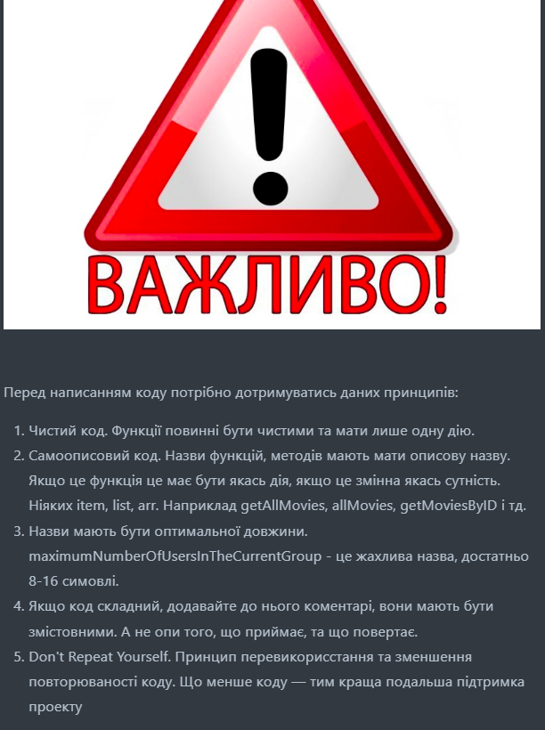

# Start of the movies_project

## version: alfa-0.7.15.9

## Good job everyone

  

## Не забуваємо створювати нову вітку, та дописувати в редмі бібліотеки, які ви додали до проєкту.

### `npm install`

### `npm start`

### Trello

<a href="https://trello.com/b/H1vKSa1a/%D0%BC%D1%83%D1%87%D0%B8%D1%82%D0%B5%D0%BB%D1%8C%D0%BD%D0%BE%D1%82%D0%B5%D0%BA%D0%B0">Trello</a>

### Figma

<a href="https://www.figma.com/file/xahj7HlNeJQjRjNKaYsL5L/--Filmoteka--?type=design&node-id=5-46&mode=design&t=WIBZtrD5GtIeekJL-0">Filmoteka</a>

### Libraries

<a href="https://www.npmjs.com/package/react-router-dome">react-router-dom</a>

<a href="https://www.npmjs.com/package/react-paginate">react-paginate</a>

<a href="https://firebase.google.com/">firebase</a>

<a href="https://axios-http.com/ru/docs/intro">axios</a>

<a href="https://react-bootstrap.netlify.app/">react-bootstrap</a>

<a href="https://mhnpd.github.io/react-loader-spinner/">react-loader-spinner</a>

<a href="https://www.npmjs.com/package/react-toastify">react-toastify</a>

<a href="https://react-slick.neostack.com/">react-slick</a>

<a href="https://github.com/kenwheeler/slick#readme">slick-carousel</a>

<a href="https://www.npmjs.com/package/yup">yup</a>

<a href="https://www.npmjs.com/package/@hookform/resolvers">yupResolver</a>

 react-responsive
</a>
